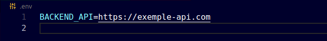
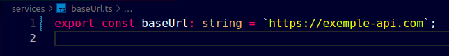
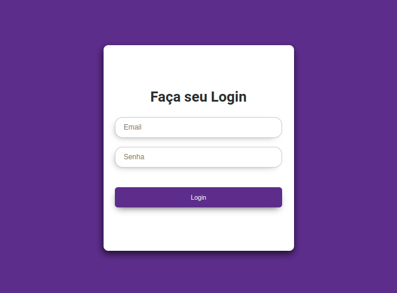
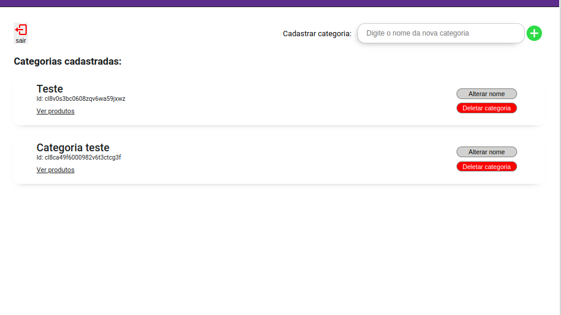
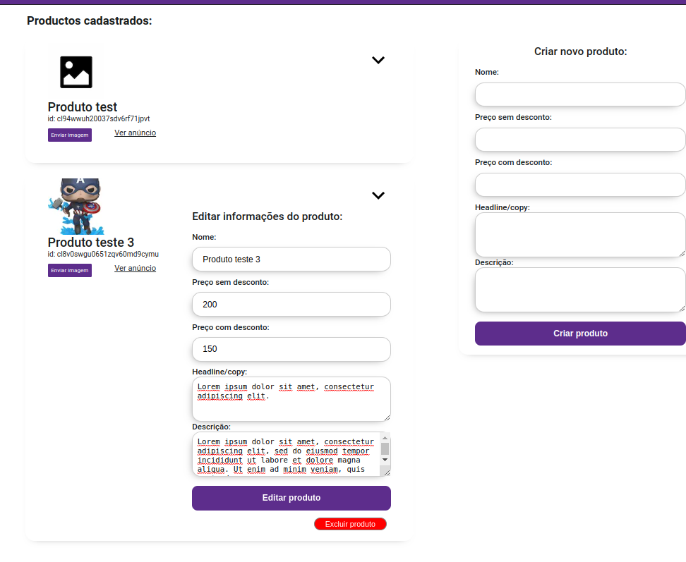
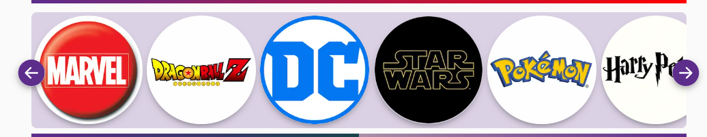

# ECOMMERCE FUNKO-STORE

Ecommerce de colecionáveis da marca [funko](https://about.funko.com/)!

### 📑 Sobre

O projeto Ecommerce Funko-store é uma aplicação criada em [Next.js](https://nextjs.org/) que trabalha consumindo uma REST Api feita em [Node.js](https://nodejs.org/en/), com autenticação, e integração de pagamentos com a [Stripe](https://stripe.com/br).

### 📋 Pré-requisitos

```
git
node
npm ou yarn
```

### 🔧 Instalação

Antes de inicar neste projeto você precisa estar com a Api de produtos devidamente configurada na sua máquina ou se preferir em um servidor remoto. Mas não se preocupe, eu já criei essa api e pode ser usada para qualquer tipo de produto. Para saber mais acesse [api-ecommerce](https://github.com/leonardoxavier01/ecommerce-api).

Depois de ter feito todas as devidas configuções e api estiver funcionando podemos iniciar a aplicação.

No seu terminal dê o comando:

```
git clone https://github.com/leonardoxavier01/ecommerce.git
```

E depois:

```
npm install ou yarn install
```

Na raiz do projeto crie um arquvio .env contendo a variável BACKEND_API e cujo seu valor seja url da sua api, por exemplo:



Após ter configurado sua variável de ambiente, também temos que configurar a baseUrl dentro de /services:



Com isso nossa aplicação já pode funcionar e consumir os dados da nossa [api-ecommerce](https://github.com/leonardoxavier01/ecommerce-api), para testar basta subir a aplicação em modo de desenvolvimento com o comando:

```
npm run dev
```

E perfeito! agora nossa aplicação está funcionando.


## ⚙️ Início como Admin do ecommerce

Para acessar a área administrativa da aplicação na qual são feito os cadastros, alterações e exclusões de produtos e categorias, basta acessar http://localhost:3000/admin/categories e inserir suas credenciais de administrador(email, password) que já estão configurados no nosso backend.



Após feito a autenticação você já pode gerenciar categorias e produtos.

Como podemos ver abaixo você pode criar categorias, deletar e alterar. Quando clicar em ver produtos você vai para a página de produtos desta categoria.



Assim como na página administrativa de categorias, na página de produtos você também pode cadastrar, deletar e alterar produtos.



## ⚙️ Personalização da aplicação

Alguns dos dados em certos componentes não são dinâmicos, e por conta disso você deve personalizá-los da forma como pereferir.

Segue o exemplo do carrosel de categorias, na qual os dados são consumidos do arquivo data/categoriesCarousel.ts que exporta um array de objetos.



Para personalizá-lo é muito simples: altere o arquivo data/categoriesCarousel.ts, e para isso basta copiar o id de uma categoria já criada que pode ser encontrado em http://localhost:3000/admin/categories, escolher o nome, e adicionar o caminho de uma imagem.


## ⚙️ Conclusão

Agora você tem um projeto de ecommerce muito bem feito e funcional, com consumo de REST Api, deploy de imagens, e integração de pagamento.

O projeto é um modelo semente que pode sim ser melhorado conforme o tempo e a necessidade de aperfeiçoamento.

## 🛠️ Construído com

- [Next.js](https://nextjs.org/) - Fremework React
- [Typescript](https://www.typescriptlang.org/) - Linguagem tipada
- [Styled-components](https://styled-components.com/) - Css in Javascript
- [React-icons](https://react-icons.github.io/react-icons/) - Biblioteca de ícones
- [React-number-format](https://github.com/s-yadav/react-number-format) - Biblioteca de formatadores de entrada/números

## 🎁 Expressões de gratidão

- Faça brincadeiras com o projeto.
- Obrigado por ler até aqui 🤓.

---

⌨️ com ❤️ por Programação em especialmente React 😊
