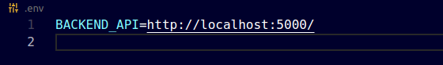

# ECOMMERCE FUNKO-STORE

Ecommerce de colecionáveis da marca [funko](https://about.funko.com/)!

### 📋 Pré-requisitos

```
git
node
npm ou yarn
```

### 🔧 Instalação

Antes de inicar neste projeto você precisa estar com a Api de produtos devidamente configurada na sua máquina ou se preferir em um servidor remoto. Mas não se preocupe, eu já criei essa api e pode ser usada para qualquer tipo de produto. Para saber mais acesse [api-ecommerce](https://github.com/leonardoxavier01/ecommerce-api).

Depois de ter feito todas as devidas configuções e api estiver funcionando podemos iniciar a aplicação.

No seu terminal dê o comando:

```
git clone https://github.com/leonardoxavier01/ecommerce.git
```

E depois:

```
npm install ou yarn install
```
Na raiz do projeto crie um arquvio .env contendo a variável BACKEND_API e cujo seu valor seja url da sua api, por exemplo:




Para rodar a aplicação em modo de desenvolvimento:
```
npm run dev
```
E perfeito! agora nossa aplicação está funcionando.

## ⚙️ Início da aplicação


## 💾 Sobre os dados


## ⚙️ Obejtivo da pokedex


## 🛠️ Construído com

- [React.js](https://reactjs.org/) - Biblioteca javascript
- [Styled-components](https://styled-components.com/) - Css in Javascript


## 🎁 Expressões de gratidão

- Faça brincadeiras com o projeto.
- Obrigado por ler até aqui 🤓.

---

⌨️ com ❤️ por Programação 😊
